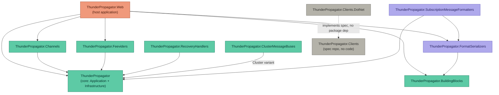

# ThunderPropagator family — project dependency graph

Cross-repo NuGet dependency graph for the ThunderPropagator product family, derived by grepping
each repo's actual `Directory.Packages.props` / `.csproj` `PackageReference` entries (not just
catalog listings — see the note on `ThunderPropagator.Web` below). Verified against the repo
checkouts on 2026-09-06.

## Edges (verified)

| From | To | How |
|---|---|---|
| `ThunderPropagator.Web` | `ThunderPropagator` (core + Application) | `$(ThunderPropagatorPackageId)`, `$(ThunderPropagatorApplicationPackageId)` |
| `ThunderPropagator.Web` | `ThunderPropagator.BuildingBlocks` | `$(BuildingBlocksPackageId)` (+ `.Modules`) |
| `ThunderPropagator.Web` | `ThunderPropagator.Channels` | 16 `Feeders.*` PackageReferences in `Web.Infrastructure.csproj`, 6 production Channels + Chat + Games/Demo in `Web.csproj` |
| `ThunderPropagator.Web` | `ThunderPropagator.Feeviders` | same 16 `Feeders.*` references above |
| `ThunderPropagator.Web` | `ThunderPropagator.FormatSerializers` | `ThunderPropagator.FormatSerializers.Yaml` in `Web.Infrastructure.csproj` and `Web.Domain.csproj` |
| `ThunderPropagator.Channels` | `ThunderPropagator` (core) | `$(ThunderPropagatorPackageId)` |
| `ThunderPropagator.Feeviders` | `ThunderPropagator` (core) | `$(ThunderPropagatorPackageId)` |
| `ThunderPropagator.RecoveryHandlers` | `ThunderPropagator` (core) | `$(ThunderPropagatorPackageId)` |
| `ThunderPropagator.ClusterMessageBuses` | `ThunderPropagator` (Cluster variant) | `$(ThunderPropagatorClusterPackageId)` |
| `ThunderPropagator.FormatSerializers` | `ThunderPropagator.BuildingBlocks` | `$(BuildingBlocksPackageId)` |
| `ThunderPropagator.SubscriptionMessageFormatters` | `ThunderPropagator` (core) | `$(ThunderPropagatorPackageId)` |
| `ThunderPropagator.SubscriptionMessageFormatters` | `ThunderPropagator.FormatSerializers` | `$(MessagePackPackageId)`, `$(NetJsonPackageId)`, `$(ProtobufPackageId)`, `$(ToonPackageId)`, `$(XmlPackageId)`, `$(YamlPackageId)` (all 6 formats) |
| `ThunderPropagator.Clients.DotNet` | — | no family package dependency; implements the wire protocol documented in `ThunderPropagator.Clients` (spec-only repo, nothing to build) |

Repos with **no incoming** family dependency (foundational): `ThunderPropagator` (core), `ThunderPropagator.BuildingBlocks`.

Repos with **no outgoing** family dependency: `ThunderPropagator`, `ThunderPropagator.BuildingBlocks`, `ThunderPropagator.Clients.DotNet`.

## Note on `ThunderPropagator.Web`'s catalog

`ThunderPropagator.Web`'s `Directory.Packages.props` also lists `PackageVersion` catalog entries for
every package published by `ThunderPropagator.RecoveryHandlers`, `ThunderPropagator.SubscriptionMessageFormatters`,
and `ThunderPropagator.ClusterMessageBuses` (it doubles as a full family catalog, by its own header
comment), but **no `.csproj` in that repo actually has a `PackageReference` to any of them** — confirmed
by grepping every `.csproj` under the repo. Those three are shown above only via their real dependents
(each other / core), not via Web, since Web doesn't genuinely depend on them today.

## Build-time-only dependency (not shown above)

Every repo in this graph — including this one's own siblings — also depends on
`ThunderPropagator.SharedBuild` at *build* time (via `Directory.Build.props` → `SharedProps.props` →
the `Shared.NugetBuild.props` router), for centrally-managed build/package properties, `Shared.PackageIds.props`,
and the `Update-ThunderPropagatorDependencies.ps1` dependency updater. That's tooling, not a NuGet
package reference, so it's intentionally left off the graph above to keep it a genuine *product*
dependency graph rather than a build-infrastructure one.
