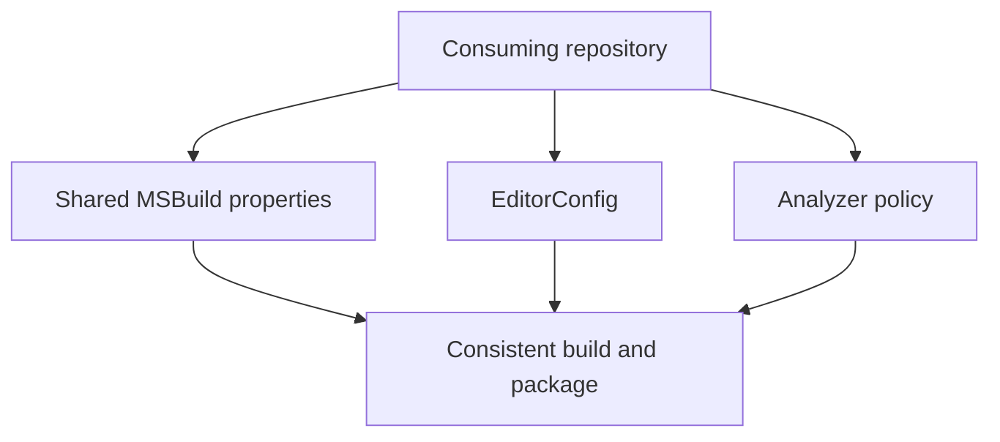

# ThunderPropagator.SharedBuild Documentation

Shared MSBuild properties, code-style rules, and analyzer defaults for ThunderPropagator .NET repositories.

## Contents

- [Overview](#overview)
- [Documentation areas](#documentation-areas)
- [Repository files](#repository-files)
- [Shared build policy](#shared-build-policy)
- [Diagrams](#diagrams)
- [Package dependencies](#package-dependencies)
- [Coverage audit](#coverage-audit)

## Overview

Shared MSBuild properties, code-style rules, and analyzer defaults for ThunderPropagator .NET repositories.

## Documentation areas

This repository is documentation- or policy-focused. Its authoritative specifications and shared configuration are cataloged below rather than represented as source-code areas.

## Repository files

| File | Purpose |
|---|---|
| [`.editorconfig`](../.editorconfig) | Contains the .editorconfig implementation or configuration. |
| [`analysers.props`](../analysers.props) | Contains the analysers implementation or configuration. |
| [`Directory.Build.props`](../Directory.Build.props) | Centralizes shared build or package-version settings. |
| [`Directory.Build.targets`](../Directory.Build.targets) | Contains the directory.build implementation or configuration. |
| [`Shared.Build.props`](../Shared.Build.props) | Contains the shared.build implementation or configuration. |
| [`Shared.Nuget.props`](../Shared.Nuget.props) | Contains the shared.nuget implementation or configuration. |

## Shared build policy

- `Directory.Build.props` establishes target frameworks, compiler behavior, package metadata, and CI defaults.
- `Directory.Build.targets` supplies shared target execution for consuming repositories.
- `Shared.Build.props` and `Shared.Nuget.props` centralize reusable build and packaging conventions.
- `.editorconfig` and `analysers.props` keep formatting and analyzer enforcement consistent.

## Diagrams

The shared policy layer turns repository-specific projects into consistently compiled, analyzed, and packaged artifacts.

## Package dependencies

*No external package dependencies were detected from supported manifests.*

## Coverage audit

| Documentation area | Status | Files | Types | Retry passes |
|---|---|---:|---:|---:|
| Repository specification and policy | ✅ Complete | — | — | 1 |

**Last generated:** July 27, 2026
